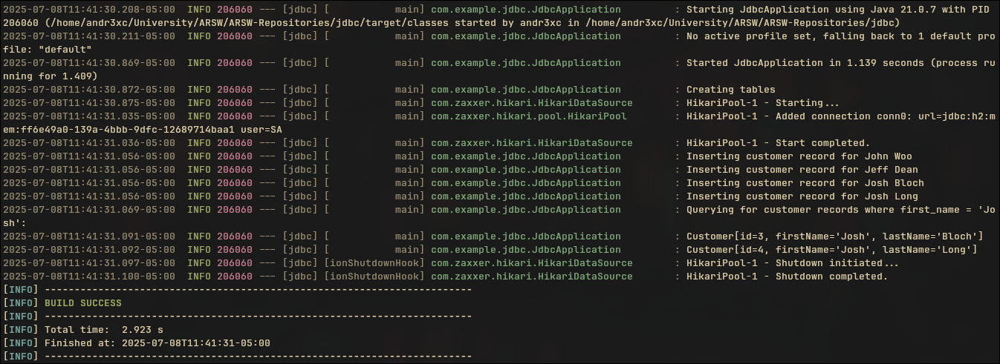
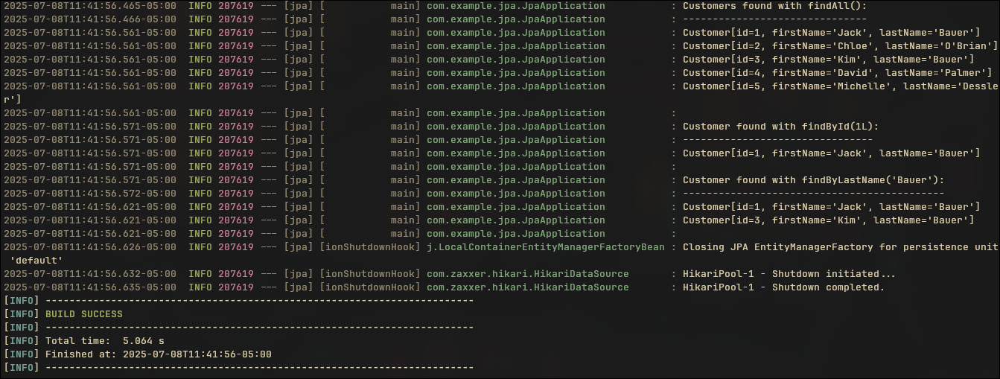

 
<div align="center">
    <h1 align="center">Spring Data Access</h1>
</div>


</br>

This repository contains three simple Spring Boot projects, each demonstrating a different data access method:

1.  **`accessing-data-jdbc`**: Data access using raw JDBC with `JdbcTemplate`.
2.  **`accessing-data-jpa`**: Data access using Spring Data JPA for relational databases.
3.  **`accessing-data-mongodb`**: Data access using Spring Data MongoDB for NoSQL databases.

</br>
</br>

## Projects

### 1. Spring Boot + JDBC

-   **Description**: A minimal example of using `JdbcTemplate` to interact with a relational database.
-   **Key Dependency**: `spring-boot-starter-jdbc`

### 2. Spring Boot + JPA

-   **Description**: A standard example of using Spring Data JPA repositories to interact with a relational database (e.g., H2, PostgreSQL).
-   **Key Dependency**: `spring-boot-starter-data-jpa`

### 3. Spring Boot + MongoDB

-   **Description**: A basic example of using Spring Data MongoDB repositories to interact with a MongoDB database.
-   **Key Dependency**: `spring-boot-starter-data-mongodb`

</br>
</br>

## How to Run

1.  **Clone the repository:**
    ```bash
    git clone [https://github.com/Andr3xDev/ARSW-Repositories.git](https://github.com/Andr3xDev/ARSW-Repositories.git)
    cd ARSW-Repositories
    ```

2.  **Navigate to a project directory:**
    ```bash
    cd accessing-data-jdbc
    # or cd accessing-data-jpa
    # or cd accessing-data-mongodb
    ```

3.  **Run the application using Maven:**
    ```bash
    mvn verify
    mvn spring-boot:run
    ```






</br>
</br>

## Requirements

-   Java 17 or later
-   Apache Maven
-   An active database instance.
